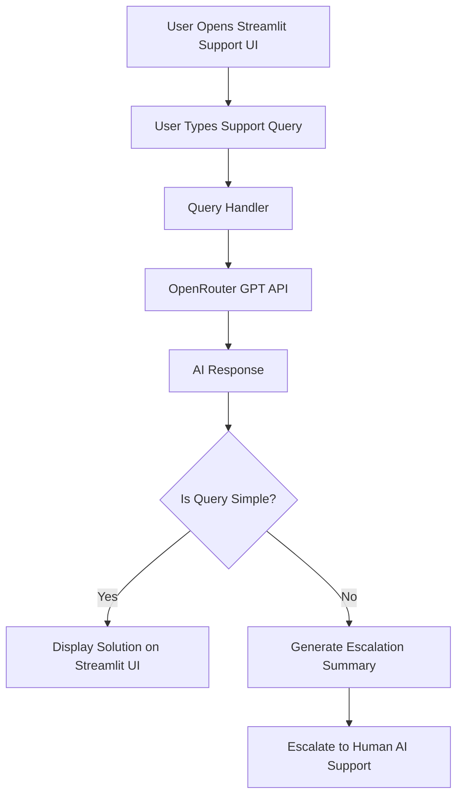

# Support Assistant Agent – AI Agent Development Challenge (48 Hours)

This project is developed as part of the **AI Agent Development Challenge**.
It is a powerful **Support Assistant Agent** that answers FAQs, handles customer queries, and escalates complex issues to human AI support.

---

## 🚀 Overview

The **Support Assistant Agent** is designed for businesses that receive frequent support queries and need:

* Instant automated answers
* Intelligent FAQ resolution
* AI Escalation for unclear or complex cases
* A clean UI for interacting with the agent

This agent improves response time, reduces support workload, and ensures customers get the help they need quickly.

---

## 🎯 Features

### ✅ Core Features

* **Streamlit UI** for interactive support chat
* **AI-powered FAQ resolution** using GPT (OpenRouter API)
* **Confidence-based escalation**
* **Handles both simple and complex queries**
* **Lightweight and deployable anywhere**

### 🛠 Advanced Behaviors

* Identifies unclear user queries
* Responds with empathetic tone
* Escalates cases with structured summary
* Provides step-by-step troubleshooting instructions when needed

---

## 🧱 Tech Stack

|       Component       |      Technology Used       |
| --------------------- | -------------------------- |
| Frontend UI           | **Streamlit**              |
| AI Model              | **GPT via OpenRouter API** |
| Environment Variables | **python-dotenv**          |
| Deployment            | **Streamlit Cloud**        |
| Version Control       | **GitHub**                 |

---

## 📁 Project Structure

```
support-assistant-agent/
│
├── streamlit_app.py     # Main application
├── requirements.txt     # Dependencies
├── architecture.md      # Architecture
├── README.md            # Project documentation
└── .env (not included, include and add your API keys while you run locally)       # Secrets and API keys
```

---

## 🔐 Environment Variables (.env)

Create a `.env` file with:

```
# OpenRouter API
OPENROUTER_API_KEY="sk-xxxxxxxxxxxxxxxxxxxxxxxxxxxxxxxxxxx" (replace your key)
OPENROUTER_BASE_URL="https://openrouter.ai/api/v1" (change accordingly)
OPENROUTER_MODEL="openai/gpt-oss-20b:free" (curretly used, you change according to your api key)
```

---

## ▶️ How to Run Locally

### **1. Clone the repository**

```
git clone https://github.com/vyduryaanand/support-assistant-agent.git
cd support-assistant-agent
```

### **2. Create virtual environment**

```
python -m venv venv
venv/Scripts/activate        (Windows)
source venv/bin/activate     (Mac/Linux)
```

### **3. Install dependencies**

```
pip install -r requirements.txt
```

### **4. Add `.env` file**

Create a `.env` file in the project root and add you keys and secrets.

### **5. Run the app**

```
streamlit run streamlit_app.py
```

---

## 🔍 Architecture Diagram

The architecture is shown below and also provided in `architecture.md`.



---

## 📦 Working Demo

🔗 **Live Streamlit App:**
[https://support-assistant-agent-j5ycrnq24ezb9zq6q7wjws.streamlit.app/](https://support-assistant-agent-j5ycrnq24ezb9zq6q7wjws.streamlit.app/)

🔗 **GitHub Repository:**
[https://github.com/vyduryaanand/support-assistant-agent](https://github.com/vyduryaanand/support-assistant-agent)

---

## ⚠️ Limitations

* No persistent database
* No ticketing system integration
* Escalation currently prints or logs output instead of actual email
* Agent resets when app restarts
* Cannot store previous chat history permanently

---

## 🚀 Potential Improvements

* Add CRM or ticketing integration (Freshdesk / Zendesk / Notion DB)
* Add vector database for company-specific documents
* Add multi-turn conversation memory
* Add user authentication
* Add analytics (query volume, topics, satisfaction score)

---

## 🧪 How to Test the Agent

1. Enter a query like:

   * “How do I reset my password?”
   * “What is the refund policy?”
2. Check the agent’s response
3. Try an unclear question like:

   * “Why isn’t it working?”
4. See escalation behavior

---


## 👨‍💻 Author
**Vydurya Anand**

AI Agent Developer

GitHub: [https://github.com/vyduryaanand](https://github.com/vyduryaanand)
