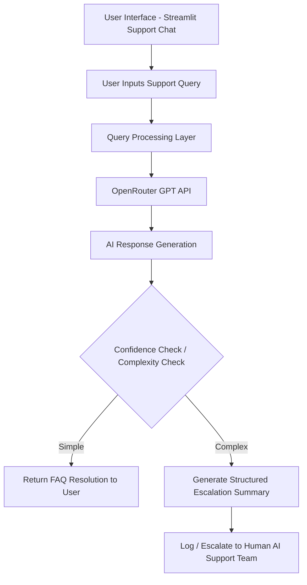

# Architecture Diagram – Support Assistant Agent

---

### Explanation

* User asks a support question
* AI processes query and generates answer
* If the answer is confident → agent replies
* If query is unclear/complex → escalates
* Optional: Escalation can be sent to email / CRM if implemented
